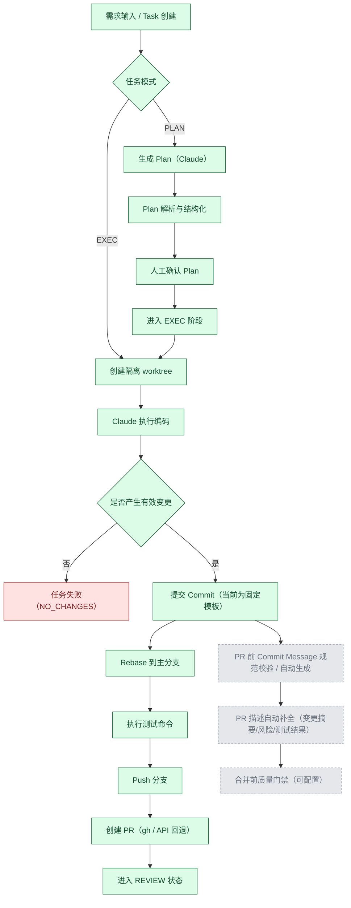

# Agentic Coding 流程图（初稿）

说明：本稿用于后续逐步完善的基线版本。  
状态约定：**绿色=已完成**，**置灰=待完善（尚未完成）**。

## 节点状态清单（初稿）

| 节点 | 当前状态 | 备注 |
|---|---|---|
| Task 创建、PLAN/EXEC 分流 | 已完成 | 后端已有任务模式与状态流转 |
| PLAN 生成、解析、人工确认 | 已完成 | `PLAN_RUNNING -> PLAN_REVIEW -> EXEC` |
| worktree 隔离执行 | 已完成 | 执行前创建、结束后清理 |
| Commit/Rebase/Test/Push/PR | 已完成 | 已在执行流水线中串联 |
| PR 前 commit message 规范化 | 待完善（置灰） | 当前 commit message 为固定模板，缺少规范校验与增强 |
| PR 描述自动补全 | 待完善（置灰） | 当前 PR body 固定为默认文案 |
| 合并前质量门禁 | 待完善（置灰） | 建议加入可配置策略（如测试覆盖/标签/审批） |

## 建议的下一步完善顺序

1. `PR 前 commit message 规范化`（优先）  
2. `PR 描述自动补全`（次优先）  
3. `合并前质量门禁`（最后接入，可配置化）

