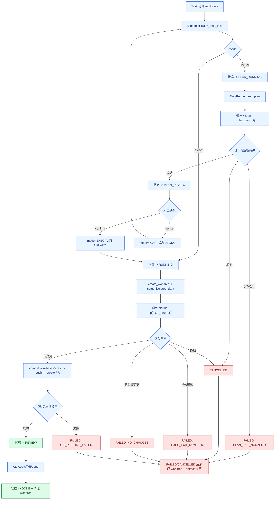

# Claude 驱动 Agentic Coding 流程（当前实现）

说明：本文档描述当前代码中已落地的真实执行链路，以后端实现为准。

## 1. 端到端主流程

## 2. 关键状态机

状态枚举来自 `backend/app/models.py`：

- `TODO`
- `PLAN_RUNNING`
- `PLAN_REVIEW`
- `READY`
- `RUNNING`
- `REVIEW`
- `DONE`
- `FAILED`
- `CANCELLED`

典型流转：

- Plan 主链路：`TODO -> PLAN_RUNNING -> PLAN_REVIEW`
- Plan 退回：`PLAN_REVIEW -> TODO`（保持 `mode=PLAN`，重新进入排队后才会再次变为 `PLAN_RUNNING`）
- Confirm 后执行：`PLAN_REVIEW -> READY -> RUNNING -> REVIEW -> DONE`
- 失败/取消：`*_RUNNING -> FAILED/CANCELLED`

### 看板列映射（聚合列）

`backend/app/store/json_store.py::board()` 将状态聚合到 6 列：

- `TODO` 列：`TODO`、`READY`
- `RUNNING` 列：`PLAN_RUNNING`、`RUNNING`
- `REVIEW` 列：`PLAN_REVIEW`、`REVIEW`
- `DONE` 列：`DONE`
- `FAILED` 列：`FAILED`
- `CANCELLED` 列：`CANCELLED`

## 3. 失败分支与恢复机制

### 3.1 取消与超时

- 取消入口：`POST /api/tasks/{task_id}/cancel`
- 调度器调用 `runner.cancel()` 终止子进程，Runner 将任务标记为 `CANCELLED`
- 超时控制：单次 Claude 子进程默认 45 分钟超时，写入 `timeout` 事件后终止

### 3.2 Claude session resume 回退

当已有 `claude_session_id` 时，Runner 优先 `--resume`。若出现可恢复错误（如 session not found）：

- 写入事件 `session_resume_failed`
- 自动创建新 session，写入 `session_fallback_created`
- 使用新 session 重试同一 prompt

### 3.3 失败后的 worktree 清理与快照

Exec 任务在 `FAILED`/`CANCELLED` 时会：

- 先尝试快照：`state/artifacts/<task_id>/<run_id>/`
- 再执行 worktree 清理（remove/prune/delete branch）
- 记录 `worktree_cleanup` 事件（`success/failed/...`）

## 4. 阶段-代码锚点-事件对照

| 阶段 | 代码锚点 | 关键事件 / 状态 |
|---|---|---|
| 任务领取与并发 worker | `backend/app/core/scheduler.py` | `claim_next_task`；`worker-{n}` 抢占 |
| 状态原子切换 | `backend/app/store/json_store.py::claim_next_task` | PLAN: `TODO->PLAN_RUNNING`；EXEC: `TODO/READY->RUNNING` |
| Claude 命令构造 | `backend/app/core/runner.py::_build_claude_cmd` | `claude -p ... --output-format stream-json --verbose` |
| Claude 子进程执行 | `backend/app/core/runner.py::_run_claude_cmd` | `command`、`stream`、`timeout` |
| PLAN 执行与解析 | `backend/app/core/runner.py::_run_plan` + `core/plan_parser.py` | `PLAN_REVIEW`、`PLAN_EXIT_NONZERO` |
| PLAN 确认/退回 | `backend/app/api/tasks.py` | `plan/confirm` -> `READY`；`plan/revise` -> `TODO` |
| EXEC Git 流水线 | `backend/app/core/runner.py::_run_exec` + `core/git_ops.py` | `NO_CHANGES`、`EXEC_EXIT_NONZERO`、`GIT_PIPELINE_FAILED`、`REVIEW` |
| Done 与清理 | `backend/app/api/tasks.py::mark_done` | `REVIEW->DONE` + `worktree_cleanup` |

## 5. Claude CLI 实际执行证据

当前实现中，任务执行器不是抽象 LLM SDK，而是直接调用 `claude` CLI：

- 命令模板来源：`backend/app/core/runner.py::_build_claude_cmd`
- 健康检查依赖：`backend/app/core/health.py` 检查 `shutil.which("claude")`
- 运行证据：`state/logs/*.ndjson` 中会落盘 `type="command"` 事件，`cmd` 字段为 `claude -p ...`

这使得流程具备可审计性：可以按 task 日志还原每次 prompt、session、执行输出与失败点。
