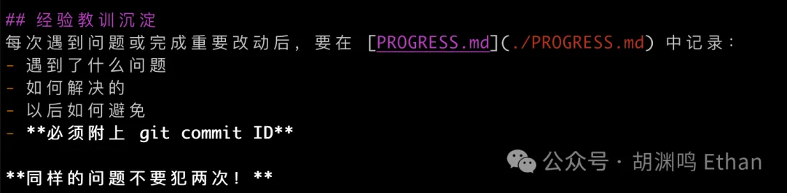
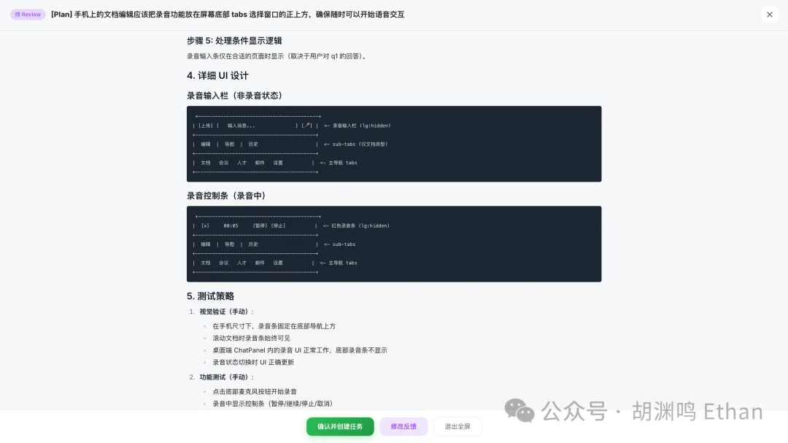

# 胡渊鸣 | 我给 10 个 Claude Code 打工

## 序

我们生活在一个剧变的时代。我生命的前三十年，从来没有过这样的感觉：技术每天在颠覆式地进步，我每天都在不断自我解构，连一些基本的问题的答案都搞不清楚：

>24 小时之前的思考是否还成立？
我今天做的事情能持续多少天不被 AI 替代？
我与 AI 到底有什么不同？
我是谁？如何在 AI 时代做出与众不同的创新？

毫无疑问，人类社会正在以惊人的速度在重构。生活在硅谷，对这种颠覆性创新的体感尤其明显。人类历史的奇点已来。
独自思考不如敞开和大家交流。2026 新年伊始，我也跨入 “奔四” 的年纪，也许现在是时候分享一些自己的看法与大家交流碰撞。我简单自我介绍一下：我 2017 年从清华姚班毕业，随后到麻省理工学院（MIT）攻读计算机图形学博士学位。博士期间我开发了 Taichi 编程语言及其编译器，用于方便用户编写 GPU 上的高性能物理仿真程序，获得了 28K GitHub stars 和 SIGGRAPH 最佳博士论文提名；2021 年博士毕业后我带领一支国际化的团队创立了太极图形。一开始商业化并不成功，后来看到 AI 的机会我就带公司转型做了 Meshy AI。Meshy 现在是全球 3D AI 领域市场份额第一的产品，最近 24 个月营收一直保持 30% month over month 的增长，最近达到了 $30M ARR，是湾区南部增长最快的 AI 公司之一。

在 MIT 搞研究的时候，我用的名字是 Yuanming Hu。创业以后，为了和美国客户打交道方便，两年前我让 ChatGPT 给我起了个英文名：Ethan。

这第一篇 blog，我想记录一下最近一个月我和 Claude Code 相互 “压榨” 的故事，也就是 “我如何给 AI 铺路，让它替代一部分的自己，以及这意味着什么”。


## 问题描述


事情的起因是我希望用 Vibe coding 开发一个只给我自己用的 “CEO 支持软件”。具体来说，这个系统应该解决我的日常文档写作、重要邮件查收（以前是 EA 的活）、会议前安排等等。以文档写作功能举例，作为一个小型跨国科技公司 CEO，我对编写文档的需求非常特殊，也许可以总结为一个 “agentic doc with voice input”：

我醒着的时候经常蹦出来一些想法，但是手边没有工具来记录。结果是这些想法就从脑海里面划过了，以后再也想不起来了。我希望这些想法必须能够被方便地记录。甚至是不方便打字的情况下，比如说在飞机上、FSD 驾驶中、走在路上、Uber 里面、在餐馆等饭的时候、晚上睡前躺在床上等等，都需要不遗漏这些想法，所以语音输入很重要
我平时主要用 Mac 和 iPhone，需要双端支持
我会希望能够对着文档的 Context 用 ChatGPT。Cursor Agent 无法在手机上运行，ChatGPT 无法实现我的文档编辑需求
我会需要把文档同时用中英两种语言清楚地表达，为了防止 AI 翻译失误，我需要能够编辑翻译后的语言
我对文档的细节有比较强迫症的需求，如中英文、中文和数字、英文和数字之间必须有一个半角空格，中英文引号不能混用，不然我看着难受，但是我又懒得去花时间整理文档里面的这些细节
我希望我的文档逻辑清楚、用词准确、没有语法错误，但是又不想自己花大量的时间反复 proofread
我希望我的文档能够有清晰的思维导图，便于宏观上检查文档的结构


这篇文档就是我用自己的文档编辑器写的。我一开始低估了写一个可用的文档编辑器的难度，即使有 Vibe coding。所以问题很快从 “如何 Vibe code 一个文档编辑器” 变成了 “如何把 Vibe coding 的速度提高 10 倍”。


这里面的一些事情是两三周前发生的了，情况变得太快，很多内容肯定今天已经不成立了，或者已经被某个 Vibe code 出来的工具自动化了。但是我还是写出来吧。Vibe code 的结果（半）成品图如下：

图片

-----

## 提高 Agentic Coding 吞吐量的 10 个阶段

### Step 1. 从 Cursor Agent 到 Claude Code

Agentic coding 工具我主要用 Cursor Agent & Claude Code。之前用 Cursor Agent 的时候，我把它运行在一个有 4090 GPU 的 Ubuntu Desktop 上，我只花了 3 个小时就重新设计了一套 GPU DSL，能够在 Ada 架构的 bf16 gemm 上面通过 async load、wmma、swizzeling、pipelining 等技巧实现 cuBLAS 80%~90% 的性能，已然非常惊艳、离谱。我觉得放在几年前，这得花我 3 周时间。假设一个 MIT PhD 三周可以工作 300 小时，这是 100 倍的产出提升。我一直说要做个 Taichi 2.0 解决一下团队平常训 3D foundation model 的性能问题，想等招到比自己更强的人再开始做。结果我招到了 Cursor。（关于 Taichi 2.0 这部分，以后的文章再说。）

图片
远程的时候，我会用 `RustDesk` 访问。但是问题是 vibe coding 的灵感是每时每刻都会蹦出来的，如果必须打开 Macbook 上的 RustDesk 才能发送指令，很多任务就无法完成。

于是我义无反顾地切换到了没有图形界面、远程更加友好的 Claude Code，在 iPhone 上面通过 ssh 访问。这样至少能够做到只要有手机就能派活了。一下子把可以 Vibe code 的时间从 8 小时提高到了 24 小时。

下面主要讨论在用 Claude Code 编写我的 “CEO 支持系统” 的时候，有哪些加速技巧。

### Step 2. 找个 Container

切了 Claude Code 以后，紧接着的问题就是 Claude Code 每十几秒就会问我各种权限问题，还是不能做到 “AI 干活，我干别的”。

这时的瓶颈会变成 Claude Code 经常提示的 permission 问题。这些 permission 有的还挺危险的，包括删除文件等。我的做法是在 EC2 开了个 server，直接让 Claude Code 运行在上面，然后使用 --dangerously-skip-permission，让他收到指令以后一直干，不要回来问我：

```bash
claude --dangerously-skip-permissions
```

这样至少一个 prompt Claude Code 就能干 5 分钟左右，大大提高了 Claude Code 利用率。

温馨提示：如果你在做的 App 数据量不大，记得用 Claude Code 写一个每小时自动备份数据库的功能。别问我怎么知道的。

### Step 3. Ralph loop，让 Claude Code 不停地干活

在 EC2 上直接权限全开以后，还是不够爽。这时候的痛点是，我脑子里经常蹦出来各种想法，但是这时候 Claude Code 正在干活，导致这些想法被 backlog 了。正好一天中午和 PingCAP CTO Dongxu 一起吃饭，从他那里听说了 Ralph loop 这个词。

Ralph loop 允许 Claude Code 从一个任务列表中每次拿一个活干，直到列表为空为止。只要列表里面一直有活，Claude Code 就会一直干下去。

这个时候我干脆用 Claude Code 做了个 Claude Code 启动器，每个活干完了自动启动新的 Claude Code。我给的 prompt 很简单：“干活; 干完活退出（exit）”

“干活” 的定义在 CLAUDE.md 里面。这可能是少数我手动写了一部分的文件。（可能要把 Step 4、5 都考虑上才会理解为什么要这么写。）


### Step 4. 用 Git worktree 实现并行化

单线程的 Claude Code 很快就无法满足我的需求了。我利用 Git worktree 搭建了容器里面的容器，每个 worktree 里面开一个独立的 Claude Code。

我的 CLAUDE.md 中的架构说明（当然，这个说明也是 Claude Code 写的）：


这个时候，如果开 5 个 Claude Code，每个 Claude Code 5 分钟提交一个 commit，我基本上可以做到在 Git 上实现 1 分钟一个 commit 了。我依然在使用 GitHub 管理我的项目。实际上 GitHub 可能是我唯一偶尔点开看看项目内容的地方。


### Step 5. 用好 CLAUDE.md 和 PROGRESS.md，让 AI 长记性

CLAUDE.md 的重要性我想不用多说了。不过 CLAUDE.md 不太适合经常修改，容易改坏掉。所以我一般让 Claude Code 总结道 PROGRESS.md 里面。既然是 AI，我就不客气了：“现在把你的经验教训沉淀到 PROGRESS.md 里面，总结提炼升华，同样的错误下次不要再犯。”




### Step 6. 干掉 ssh，直接把开发界面变成手机端网页

这一步其实和前面的步骤是并行的。因为一些 Claude Code 实现的局限性，Claude Code 在 ssh 下会不停地刷新 terminal，巨卡无比。而且手机的 ssh 屏幕实在是太小，再开个 tmux 简直是极其难操作。所以我干脆写了个 Claude Code web manager。有了前面的基建，我们已经可以通过

```bash
claude -p [prompt] --dangerously-skip-permissions
```

把 Claude Code 做成非交互式的组件，所以只要起一个 Python 用 subprocess 去调度 Claude Code 就行了。

我在 iPhone 上用 Safari 把网页包装成了一个 App，方便随时打开。


当然 ssh 偶尔还是需要的，因为 web manager 崩了的时候，偶尔还是需要 ssh 上去修。


### Step 7. 有效地用 Claude Code 编写管理 Claude Code 的程序

其实实现了上面的步骤以后，因为种种原因派发任务完成率不高。这一步我卡了一小会儿，大概是因为 bootstrap 步骤里面需要用 Claude Code 编写 Claude Code manager，而被管理的 Claude Code 的返回值有些不明确，而且只有个返回值也不利于 manager 知道中间到底哪里出了问题。

众所周知，有一件事能显著提升 agent 的效果：给它提供一个“闭环”，搭建一个环境，让它能写代码 / 运行 / 检查 / 调试。我觉得未来只要是能够在一个闭环的环境中让 AI 能够端到端获得反馈的任务，都是简单的任务。

所以我用了

```bash
claude -p [prompt] --dangerously-skip-permissions \
       --output-format stream-json --verbose
```

这样我的 Claude Code manager 就能通过检查 json 格式的 log 去发现它正在管理的某个 CC 实例到底哪里出了问题，并据此提升它的管理能力。

Claude Code 并不擅长写出“用来管理其他 Claude Code 实例”的代码。就像一个 IC（个人贡献者）天生也不一定是个好经理一样…… 我花了好一阵子才把它真正跑通。

一开始 manager 派活的成功率很低，大概只有 20%，最后我也不知道怎么就成功率弄到几乎 95% 了，有点神奇。但是我也不想去搞清楚了，反正 work 了。大概是 CLAUDE.md 和 PROGRESS.md 里面记录了什么东西、Python task dispatcher 里面有些提升吧。

### Step 8. 自然语言编程

打字速度也是瓶颈。一是敲键盘本身就很慢，二是很多时候不方便敲键盘。好的想法转瞬即逝，如果没有快速的方式记录下来，是一种巨大的浪费。

于是我给我的系统的各个输入框都加上了语音识别 API，进一步提高了输入效率。可能唯一的问题是周末和朋友吃饭的时候他们会突然听你对手机说了一句字正腔圆、班味十足的话：“开发一个新闻总结功能，每 10 分钟爬取最新的 AI 新闻，并且用 ChatGPT 总结。每天将新闻的优先级从高到低排列。如何设计？”

到这一步，我基本上实现了走在马路上都可以 vibe coding 了，生产力提高 10 倍不在话下。（当然，被车撞飞的概率可能也提高了 10 倍。）

我花了大量的时间去学习英语，我觉得在未来，这方面的投资对于大部分人来说，在未来恐怕价值是越来越小了。之前还在想要不要给国内的同事请一位英语外教，提高跨语言沟通能力，后来我意识到一个要命的事实：2026 年，任何一个人类学英语的速度，都赶不上 AI 中英文翻译能力提升的速度。与其让大家学英语，不如投资到 AI 翻译工具里面。这样的结局，每个人都能用自己最高效的母语进行交流，皆大欢喜。

### Step 9. 给开发中心添加 Plan Mode

Claude Code 的 Plan 模式是非常强大的。考虑到实际上没有人去 review AI 写的代码，Plan Mode 至少可以在任务开始的时候给 AI 再明确一下我的意图。我在 Claude Code 任务管理器里面把 Claude Code 的 Plan mode 封装了一层，便于同时 kick off 大量 Plan 任务然后统一 review。




### Step 10. 坚持不去看除了 CLAUDE.md 以外的代码

杜绝对 AI 的 micromanagement（微管理）。用 AI 是锻炼一个领导者的 servant leadership 的很好的办法。不要把时间花在看代码上，而是去研究：

更好的提问，更清楚地描述需求，“Context, not control”
从第一性原理来说，目标应该是什么？Speed of light 在哪里？
我如何给 AI 打工才能让 AI 工作效率更高？
如何在 AI 写的 repo 里面实现科学的版本控制与测试驱动的开发？
如何不断提高自己的杠杆，让有限的时间内的 AI 有效产出不断放大？

-----

## 标准化软件的终结

做到了上面几步，我基本上就实现了随时有想法就可以让 AI 开发，唯一的限制是我产出想法的速度。我的 Claude Max plan credit 也能很快用完。我现在每天用着自己开发的办公软件办公，集成了文档、会议安排、邮件、新闻等等功能，用我最舒服的软件办公，大大提高了工作体验和效率。

在软件成本开发很高的时候，软件可以成为一个生意，因为大量人的共同的需求被一帮软件工程师给开发出来。在高昂的研发成本下，“共性需求能够被标准化解决”，是这些软件从商业的 ROI 上存在的前提条件：大量需求有共性的用户均摊一款标准化软件开发的成本，开发商从创造的价值中得到一部分，生意得以持续。

而 Agentic Coding 功能的存在，使得软件开发的成本会无限趋近于零。这让大量的标准化软件逐渐失去它的意义。正如市场上有 Openclaw 这样的工具以后，我还是更乐意自己去 Bootstrap 一个自己的工具，而不是使用现成的软件。因为所有有一定开发能力的用户，都会认为只有定制化的软件，才能最好地解决自己的需求，不用去用一个标准化的软件去委屈自己。有什么需求，Vibe code 一下，几分钟以后就能用了。

这个过程是渐进的。今天也许是我这样有一定开发能力的人发现自己不需要标准化软件了，在未来，也许地球上的大多数人都不需要标准化软件了。前段时间的 SaaS 股雪崩也反映了这个事情。

传统软件开发的模式也会终结。产品经理的工作会被重新定义，因为以前 “和 100 个客户聊天然后提炼出共性需求并设计解法” 已经不再需要了。 软件工程师的工作也会被重新定义，从自己手敲代码，变成给 AI 铺路和兜底，设计一套方便 AI 开发软件的框架。就像 Jeff Dean 做的 Map reduce，让普通工程师也能做分布式数据处理。以后的工程师，恐怕每天的工作就是给 AI 提供好用的框架、环境、Reward，让 AI 在闭环中驰骋。

我太太也看到我折腾的文本编辑器很好用，就问能不能开个账号给她也用用。我回复说：“我不想给别人用。这个软件是为我自己高度定制化的。我就想一个人用，这样我自己用不用管规模化部署、多用户登录、向前兼容性、稳定性等问题。这样能大幅降低开发成本，做出我最顺手的工具。我不能给你用，你要是想用就 fork 一个你自己维护去。”

她默默回问了一句：“你不爱我了吗？”

-----
****
## 人类的黄昏

我压榨 AI，是因为我希望唯一的产能限制是我的思维；AI 压榨我，是因为 Vibe coding 给我提供了比原来手动写代码更快、更强 10 倍以上的正反馈，成瘾性很强。

这段时间我和 AI 相互压榨，让我对公司甚至人类存在的意义产生了深刻的怀疑。传统企业管理垂直方向的 delegation、水平方向的跨团队协作可能不复存在了，因为他们都会变成 “如何用 AI 解决问题”。按人头记的 Headcount 会很快变成按 T 记的 token count。除了可以 7x24 不间断工作，AI 与人比起来还有一个巨大的优点：理性、直接。和 AI 沟通的时候就事论事就好，不用照顾自尊心和感受，可以更加接近事实与真相，而直接的沟通更有利于问题的解决。

Agentic coding 意味着更快的反馈循环，我还发现 “管 AI 比管人更能提高领导力”，因为反馈太快了，所有目标定义不清晰的问题，都会在 5 分钟内得到反馈，这对于 (AI) 管理者的成长速度来说，也是 100 倍的提升。

我想所有管理者都会觉得，通过自己带的团队拿到整个公司需要的结果，其实是一件很需要技巧的事情。日常的反馈中要想不让被指出问题的人陷入到 “错的不是我，错的是世界” 这样的自我保护，更是难上加难。而 AI 没有这样的问题。管理 AI 简单，高效，甚至有些残酷。

去年公司业绩不错，营收一年增长了 14 倍，我带团队到夏威夷团建。在街道上看到很多处于 “度假模式” 的悠闲的人，猛然感觉这一幕非常魔幻：似乎这个世界上在发生的最重要的事情，和这些人无关。而下一秒的技术变革，就会摧毁他们一直引以为傲的求生之技。

我尝试描述自己的感受，一旁的同事接着说道：“我记得在电影《大空头》里面有一幕：2008 年金融危机发生前，在街上的绝大多数人好像就和这个事情完全无关一样。”

图片
历史的车轮一旦开始往前滚，没有人能让它停下。最可怕的是，AI 还在加速自己的迭代速度，以一个人类无法赶上的速度起飞。也就是说，对于大部分需要花时间学习才能掌握的技能，AI 技术发展的速度都会比一个人类专心学习的速度更快，所以我们要重新审视 “学习” 的意义。

当 AI 能够替代越来越多大家过去认为 “只有人才能做” 的事情，人类也不得不解构自己，被逼迫着回答 “我们到底还有什么独特的价值”。

颠覆式创新与焦虑大概是这个时代的主旋律。自杀重生，他杀淘汰。只有面对现实，自己不断痛苦地否定、颠覆、突破自己，才能成长，才是唯一的生存之道。

我们在一个无比激动人心、又充满不确定性的年代。

不论如何，我和团队能够以最年富力强的精神状态深度参与其中、见证并参与人类历史的奇点，都是一件幸事。